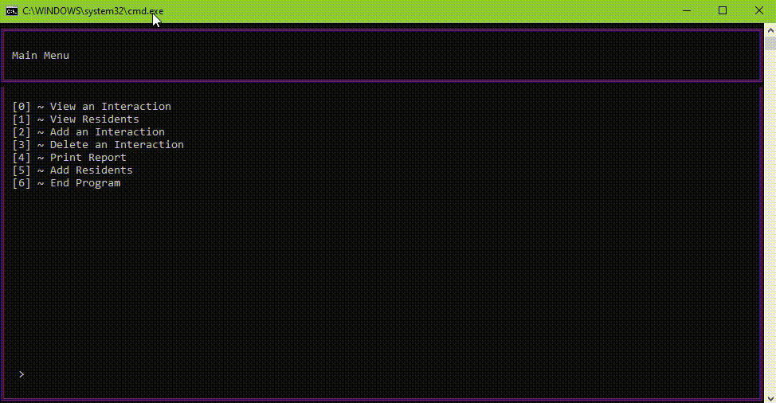
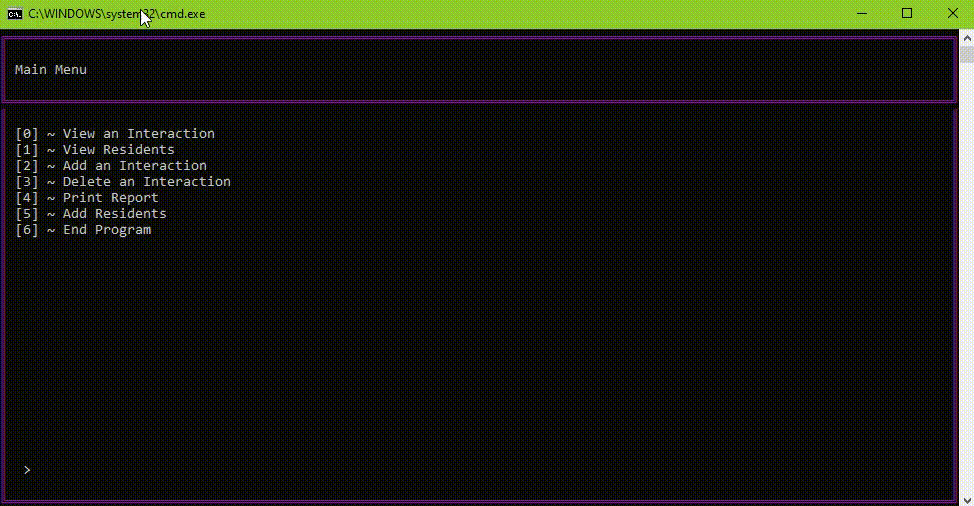
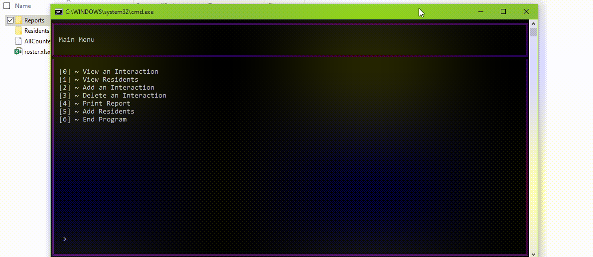

## RA Interaction Tracker

 - Title: RA Interaction Tracker
 - Last Updated: 29 May 2020
 - Language: C#
 
#### Program Description:  

When I was an RA at SDSM&T and COVID-19 forced all of us to go to school online, I was still responsible for my RA duties to keep the sense of community for my floors, both to help ease the stresses of online school and the on-going pandemic. While doing so, I needed to make weekly reports to my boss of my interactions with my residents. To allow myself to focus on onine courses and increase work while at Target, I made this program to easily add my interactions with residents, while also allowing the program to auto create and send my weekly reports to my boss using the Windows Task Scheduler. This program I was able to write within one night, so that I can continue to focus on my school work. Thus, I have used classes that I have already created from other programs, such as the display from SchoolHelper and reading the excel sheet from DoorDecCreator.

As seen below, the user must use an excel file to add new reisdents to the tracker. I choose excel because I am provided the floor rosters with this file type.

Adding interactions are then easy, just type the resident's name (or all to apply to all of them) to add the interaction.

These were the format for the reports to be made and to be sent to my boss weekly. It saves it in a report folder for future use.

I did polish this program after school was over incase I would need to use it in the future by adding a variety of qualitiy of life features.

#### Techniques/Methods Used:
 * Object oriented programming
 * File manipulation/management (Binary files and Excel files)
 * .NET Mail
 * Windows Task Scheduler
 * Git source control
